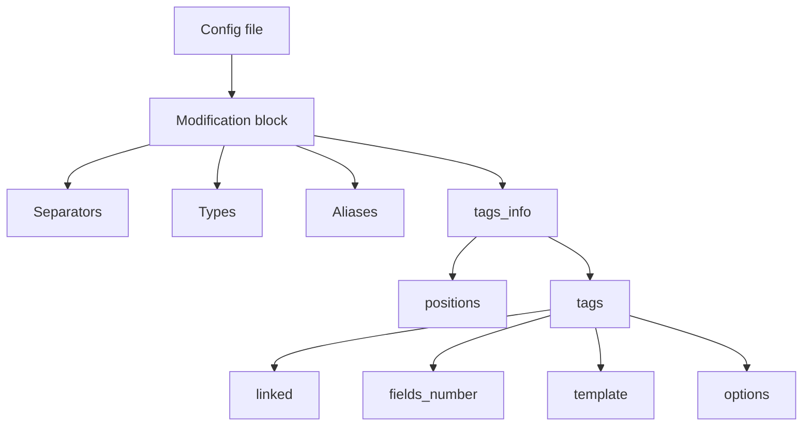
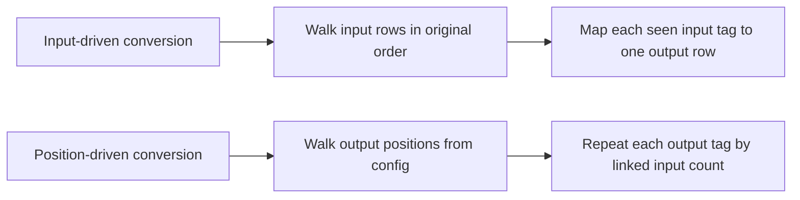

<p align="center">
<a href="https://github.com/singl3focus/hl7-converter/actions/workflows/go.yml"></a>


</p>

# HL7 Converter

`hl7-converter` is a config-driven Go toolkit for transforming HL7, ASTM, and other row-based lab messages with declarative JSON mappings.

It is built for teams that need a small, embeddable mapping engine inside LIS bridges, ETL adapters, middleware services, or device integrations, without committing to a heavyweight integration platform.

## What Problem It Solves

Lab and device integrations usually fail in the same place: the message structure is close to HL7, but never close enough.

One analyzer emits ASTM-like rows, another vendor expects HL7-ish segments, and the integration layer ends up full of one-off string parsing code. That code is hard to review, hard to test, and expensive to change when a new device or customer mapping appears.

`hl7-converter` moves that logic into JSON configuration:

- define separators and row structure once
- map input tags to output tags
- describe field templates with links like `<TAG-3>` or `<TAG-3.1>`
- add aliases for downstream routing or logging
- optionally post-process the converted result with trusted JavaScript

## When To Use It

- You need a small Go library, not a full integration server.
- Message transformation rules should live in config instead of hand-written code.
- The source and target formats are row-oriented and field-position driven.
- You need to embed conversion into an existing Go service or adapter.
- You want repeatable test coverage around mappings and templates.

## When Not To Use It

- You need a visual integration designer, queues, retries, persistence, or orchestration.
- Your mappings require deep business workflows rather than deterministic field transformation.
- Your payloads are not fundamentally row/tag based.
- You need sandboxed user scripting. JavaScript hooks here are trusted-code only.

## 30-Second Quick Start

```bash
go get github.com/singl3focus/hl7-converter/v2@latest
```

```go
package main

import (
	"log"

	hl7converter "github.com/singl3focus/hl7-converter/v2"
)

func main() {
	params, err := hl7converter.NewConverterParams("./examples/config.json", "astm_hbl", "mindray_hbl")
	if err != nil {
		log.Fatal(err)
	}

	converter, err := hl7converter.NewConverter(
		params,
		hl7converter.WithUsingPositions(),
		hl7converter.WithUsingAliases(),
	)
	if err != nil {
		log.Fatal(err)
	}

	input := []byte("H|\\^&|||sireAstmCom|||||||P|LIS02-A2|20220327\n" +
		"P|1||||^||||||||||||||||||||||||||||\n" +
		"O|1|142212||^^^Urina4^screening^|||||||||^||URI^^||||||||||F|||||\n" +
		"R|1|^^^Urina4^screening^^tempo-analisi-minuti|180|||||F|||||\n" +
		"R|2|^^^Urina4^screening^^tempo-analisi-minuti|90|||||F|||||")

	result, err := converter.Convert(input)
	if err != nil {
		log.Fatal(err)
	}

	log.Print(result.String())
}
```

Repository sample config: `examples/config.json`.

## Input / Output Example

Input:

```text
H|\^&|||sireAstmCom|||||||P|LIS02-A2|20220327
P|1||||^||||||||||||||||||||||||||||
O|1|142212||^^^Urina4^screening^|||||||||^||URI^^||||||||||F|||||
R|1|^^^Urina4^screening^^tempo-analisi-minuti|180|||||F|||||
R|2|^^^Urina4^screening^^tempo-analisi-minuti|90|||||F|||||
```

Output:

```text
MSH|^\&|Manufacturer|Model|||20220327||ORU^R01||P|2.3.1||||||ASCII|
PID||142212|||||||||||||||||||||||||||
OBR||142212|||||||||||||URI|||||||||||||||||||||||||||
OBX|||Urina4^screening^tempo-analisi-minuti|tempo-analisi-minuti|180||||||F|||||
OBX|||Urina4^screening^tempo-analisi-minuti|tempo-analisi-minuti|90||||||F|||||
```

## Mapping Config Example

```json
{
  "mindray_hbl": {
    "component_separator": "^",
    "component_array_separator": " ",
    "field_separator": "|",
    "line_separator": "\r",
    "aliases": {
      "Header": "MSH-9.2",
      "PatientID": "PID-3",
      "Key": "OBR-16"
    },
    "tags_info": {
      "positions": {
        "1": "MSH",
        "2": "PID",
        "3": "OBR",
        "4": "OBX"
      },
      "tags": {
        "MSH": {
          "linked": "H",
          "options": ["autofill"],
          "fields_number": 19,
          "template": "MSH|??^\\&|??Manufacturer|??Model|||<H-14>||??ORU^R01|<H-3>|<H-12>|??2.3.1||||||??ASCII|"
        },
        "PID": {
          "linked": "P",
          "fields_number": 30,
          "template": "PID||<O-3>|||||||||||||||||||||||||||"
        }
      }
    }
  }
}
```

## Architecture Overview

### Conversion Flow


### Config Structure



### Conversion Modes



## Supported Mapping Features

- Custom line, field, component, and component-array separators.
- Output generation by input order or by explicit configured positions.
- Template links like `<TAG-3>` and component links like `<TAG-3.1>`.
- Default literals with `??value`.
- Aliases for extracting stable values from the converted result.
- Trusted JavaScript post-processing via `Result.UseScript`.

### Supported Options

- `autofill`: append empty trailing fields while parsing an input row until it matches the tag `fields_number`.

## Validation Model

Validation now happens in two layers:

1. `Modification.Validate()`
   - checks required separators
   - rejects separator conflicts
   - validates positions keys and references
   - validates known options
   - validates template field count and link/default syntax
2. `NewConverterParams()`
   - validates the selected input/output pair together
   - rejects output templates that reference unknown input tags
   - rejects links that point outside known input field ranges when `fields_number` is explicit

This means invalid mappings fail earlier, before conversion starts.

## Concurrency And Safety

- `Converter` is safe for concurrent `Convert` calls on the same instance.
- `Result` is mutable and is not guaranteed safe for concurrent mutation.
- JavaScript hooks are trusted-code only. There is no built-in sandbox or timeout.

## Public API Snapshot

- Construction: `NewConverterParams`, `NewConverter`
- Converter options: `WithUsingPositions`, `WithUsingAliases`
- Execution: `Convert`, `ParseMsg`, `ParseInput`, `IndetifyMsg`
- Result helpers: `FindTag`, `ApplyAliases`, `UseScript`, `SwapRows`, `SetRow`
- Field helpers: `Components`, `Array`, `ComponentsChecked`, `ArrayChecked`

## Limitations

- Designed for ASCII-oriented messages and simple string-based separators.
- Template semantics are intentionally narrow: deterministic field mapping, not workflow orchestration.
- Component validation can only be checked at runtime because input payload shape may vary per message.
- JavaScript support is for controlled operational environments, not end-user scripting.

## Testing And Benchmarks

Run the full test suite:

```bash
go test ./...
```

Run with the race detector:

```bash
go test -race ./...
```

Run benchmarks:

```bash
go test -bench=. ./...
```

The repository includes:

- unit tests for config validation, template parsing, conversion modes, aliases, and field helpers
- concurrency tests for shared `Converter` usage
- fuzz coverage for `Convert`
- benchmarks for realistic message payloads

## License

MIT
